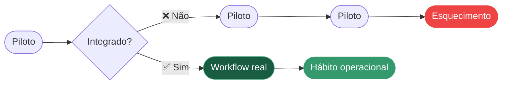

<!-- Slide 01 — Capa -->

  
HOUSTON, TX | ABRIL/2026

  <h1 class="text-5xl font-bold leading-tight mb-4" style="color: var(--rf-primary); font-size: 3.2rem">Tendências de IA em O&G O que já temos aqui</h1>
  
Disseminação do 11th Annual AI in Oil & Gas Conference

  
Ramon Moreno Ferrari | CSDA / UO-ES

  PETROBRAS

<!--
"Bom dia, pessoal. Em abril tive a oportunidade de participar do maior evento global de IA aplicada ao setor de óleo e gás, em Houston. Hoje vou compartilhar o que vi, o que aprendi — e como isso se conecta com o que já estamos construindo aqui no Espírito Santo. Temos 50 minutos, então vamos com calma."
-->

---

<!-- Slide 02 — O Evento: Números -->

# O Evento

  

    
423

    
participantes

  

  

    
63

    
palestrantes

  

  

    
91

    
patrocinadores

  

<Spacer :h="10"/>

  

<!--
"O evento reuniu 423 participantes — o maior número da história do evento. Estavam presentes ExxonMobil, Chevron, BP, Oxy, Saudi Aramco, Shell, Murphy Oil… e a Petrobras. Líderes de dados, CDOs, engenheiros, cientistas de dados e gestores de operações — todos no mesmo espaço discutindo como a IA está transformando o setor."
-->

---

<!-- Slide 03 — O Evento: Clima -->

# O Evento

  

<!--
"O clima do evento foi de urgência construtiva. Não era mais uma conferência sobre o futuro da IA — era sobre execução. As palestras eram práticas, com casos reais, números de ROI, lições aprendidas. Eu saí de lá com a sensação de que o mundo está se movendo rápido — e com a certeza de que estamos no caminho certo aqui no ES."
-->

---

<!-- Slide 04 — Os 11 Grandes Temas -->

# Os 11 Grandes Temas do Evento

<GlassCard title="Eixo Técnico" subtitle="🔵 TECNOLOGIA">

- Agentes Autônomos (Agentic AI)
- Digital Twins e Manutenção Preditiva
- Inspeção por Drones e Visão Computacional
- IA Generativa e RAG Corporativo
- Modelos Híbridos e Escolha da Ferramenta Certa
- Qualidade e Orquestração de Dados

</GlassCard>

<GlassCard title="Eixo Humano" subtitle="🟠 ORGANIZAÇÃO">

- Superando a fase de "Purgatório dos Pilotos"
- Governança, Segurança e Responsabilidade
- Mudança Organizacional e Liderança
- Velocidade da Inovação e Gestão de Riscos
- Casos de Uso com Ganhos Tangíveis

</GlassCard>

<!--
"Os temas se organizaram em dois grandes eixos. De um lado, as tecnologias emergentes. Do outro, os desafios organizacionais — que, na minha visão, foram o coração do evento. Hoje vou mergulhar nos dois. Vamos começar pelo que me chamou mais atenção: os desafios que o mundo enfrenta para fazer a IA funcionar de verdade."
-->

---
transition: fade
---

<!-- Slide 05 — Seção: Desafios -->

  

    
DESAFIOS E DIFICULDADES

    <h1 class="text-5xl font-bold leading-tight mb-4">Por que a IA ainda trava nas organizações?</h1>
    <Subtitle>As barreiras reais que o setor enfrenta, para além do hype</Subtitle>
  

<!--
"Antes de falar das soluções, preciso falar dos problemas. Uma coisa que me marcou foi a honestidade dos palestrantes sobre as dificuldades reais. Não foi uma conferência de hype — foi uma conferência de gente que já errou e aprendeu. Vamos ver os principais desafios que o setor enfrenta."
-->

---

<!-- Slide 06 — O Purgatório dos Pilotos (Parte 1) -->

# O Purgatório dos Pilotos

  

    "Defina o entregável concreto antes de construir qualquer modelo." -- Lesley Ward, Novanix AI
  

  
— Lesley Ward, Novanix AI

<!--
"O tema mais recorrente foi o 'pilot purgatory'. As empresas conseguem fazer um piloto de IA funcionar, mas não conseguem transformá-lo em operação real."
-->

---

<!-- Slide 06b — O Purgatório dos Pilotos (Parte 2) -->

# O Purgatório dos Pilotos: As 3 Causas

  <GlassCard title="Sem dono na operação em rotina" subtitle="CAUSA 1">Sem responsável por prover abrangência ao piloto</GlassCard>
  <GlassCard title="Solução fora dos workflows" subtitle="CAUSA 2">Solução não foi mapeada nos processos existentes</GlassCard>
  <GlassCard title="Sucesso técnico ≠ adoção" subtitle="CAUSA 3">Modelo funciona, mas ninguém usa no dia a dia</GlassCard>

  

    Piloto que tecnicamente funciona mas nunca entra no workflow real 
    <strong>não gera valor</strong>.  
  

<!--
"Três causas raízes para o pilot purgatory que vimos em Houston."
-->

---

<!-- Slide 09 — Dados: o Gargalo -->

# Dados: o alicerce e o maior gargalo

  

    "A IA amplifica tanto boas decisões quanto erros."
  

  
— Syniti, AI in Oil & Gas 2026

  <GlassCard title="Dados incompletos" subtitle="PROBLEMA 1">Incompletos, inconsistentes ou sem contexto operacional</GlassCard>
  <GlassCard title="Sistemas desconectados" subtitle="PROBLEMA 2">IT, OT e ET que nunca foram pensados para conversar</GlassCard>
  <GlassCard title="Sem governança" subtitle="PROBLEMA 3">Falta de taxonomia, metadados e gestão de qualidade</GlassCard>

<!--
"A Syniti teve uma fala que ficou na minha cabeça: 'A IA amplifica tanto boas decisões quanto erros.' Dados ruins escalam tão eficientemente quanto dados bons. E o problema de dados no setor de O&G é estrutural: temos sistemas de IT, OT e ET que nunca foram pensados para conversar. Tags diferentes para o mesmo ativo, hierarquias inconsistentes, metadados ausentes. Sem resolver isso, qualquer modelo de IA vai ser construído sobre areia."
-->

---

<!-- Slide 08 — Segurança e Governança (Parte 1) -->

# Segurança, Governança e Movimento Rápido

<GlassCard title="Riscos reais" subtitle="❌ PREOCUPAÇÕES">

- Lock-in em fornecedor único
- Agentes sem limites claros
- IA em sistemas críticos sem auditoria
- Código gerado sem revisão humana

</GlassCard>

<GlassCard title="O que funciona" subtitle="✅ BOAS PRÁTICAS">

- Human-in-the-loop em decisões críticas
- Responsible AI proporcional ao risco
- Rastreabilidade e trilha de auditoria
- Governança como requisito primeiro

</GlassCard>

  

    Velocidade e governança não são opostos. 
    São complementares.
  

<!--
"A Chevron Phillips teve uma palestra provocativa chamada 'Hype vs. Reality'. Brent Railey foi direto: o custo da inação é alto — mas a pressa sem governança pode ser pior."
-->

---

<!-- Slide 08b — Segurança e Governança (Parte 2) -->

# Segurança e Governança: Na Prática

  <ImagePanel src="./slide8-1.png" position="center" width="100%" fit="contain" />
  <ImagePanel src="./slide8-2.png" position="center" width="100%" fit="contain" />

  

    Avaliação ao risco, rastreabilidade e educação contínua.
  

<!--
"A Chevron apresentou seu framework de Responsible AI — avaliação proporcional ao risco, rastreabilidade, educação da força de trabalho. A mensagem: velocidade e governança não são opostos. São complementares."
-->

---

<!-- Slide 11 — O Maior Desafio é Humano -->

# O Maior Desafio é Humano

  

    71%+
    das falhas são 
    questões organizacionais, culturais e de liderança
  

  

    
💰

    

      
Incentivos inadequados

      
Não há alinhamento entre objetivos e recompensas

    

  

  

    
🧭

    

      
Liderança reverte à intuição

      
Decisões data-driven são abandonadas sob pressão

    

  

  

    
👥

    

      
Papéis não redesenhados

      
Equipes recebem ferramentas mas responsabilidades não mudam

    

  

  

    
❓

    

      
Responsabilidade indefinida

      
Ninguém é dono dos resultados da IA na operação

    

  

<!--
"Uma das palestras mais marcantes foi da Lisa Williams, da Dow. Ela disse: 71% das falhas em transformações de IA são organizacionais. Não é o modelo que falha — é a organização que não muda junto. Líderes que endossam a IA verbalmente, mas revertem à intuição quando a recomendação contraria a experiência deles. Times que recebem mais ferramentas sem ter os papéis redesenhados. Isso ressoa muito com a nossa realidade."
-->

---
transition: fade
---

<!-- Slide 12 — Transição: Tendências Tecnológicas -->

  

    
TENDÊNCIAS TECNOLÓGICAS

    <h1 class="text-5xl font-bold leading-tight mb-4">Agora, o que está funcionando</h1>
    <Subtitle>As 5 tendências tecnológicas que mais  chamaram atenção</Subtitle>
    <Spacer :h="24" />
    

      
🤖Agentes

      
🏭Digital Twins

      
🚁Drones

      
📄IA Generativa

      
📊Responsible AI

    

  

<!--
"Depois de entender os desafios, vamos ao que está funcionando. Vou apresentar as cinco tendências tecnológicas que mais me impressionaram — com exemplos reais de empresas que já estão colhendo resultado."
-->

---

<!-- Slide 13 — Tendência 1: Agentes Autônomos (Diagrama) -->

# Tendência 1: Agentes Autônomos

<ArchitectureFlow>

</ArchitectureFlow>

<!--
"Uma tendência muito marcante foi a agentic AI — sistemas de múltiplos agentes autônomos que colaboram para resolver problemas complexos."
-->

---

<!-- Slide 13b — Agentes Autônomos (Case Real) -->

# Tendência 1: Agentes Autônomos — Case Real

  

<!--
"A NTT DATA mostrou um caso real: seis agentes especializados trabalhando em conjunto para detectar, diagnosticar e prevenir falhas em fundo de poço. Cada agente tem um papel específico. O humano entra apenas para aprovar a decisão final. O sistema estima NPT evitado em tempo real. Isso é operação agentica — e está chegando."
-->

---

<!-- Slide 14 — Tendência 2: Digital Twins (Cases) -->

# Tendência 2: Digital Twins e Manutenção Preditiva

<GlassCard title="Cases Reais — Covestro" subtitle="DETECÇÃO PRECOCE">

**Válvula lenta:** atuador 3× mais devagar → troca proativa

**Compressor:** anomalia detectada **5 meses antes** do evento

**Bomba:** desvio de curva → troca preventiva para reserva

</GlassCard>

<Callout type="info">
Digital twin sem workflow de resposta não gera valor. Tecnologia + processo faz diferença.
</Callout>

<!--
"A Covestro tem 502 válvulas de segurança e 266 válvulas de controle monitoradas em tempo real."
-->

---

<!-- Slide 14b — Digital Twins: Covestro -->

# Tendência 2: Digital Twins — Dashboard Covestro

  

<!--
"A Covestro tem 502 válvulas de segurança e 266 válvulas de controle monitoradas em tempo real. Em um dos casos apresentados, o sistema detectou que uma válvula demorava 3 vezes mais para abrir — a equipe agiu antes da falha. Em outro, uma anomalia em compressor foi detectada 5 meses antes do evento real. A lição: digital twin sem workflow de resposta definido não gera valor. Tecnologia mais processo é o que faz diferença."
-->

---

<!-- Slide 15 — Tendência 3: Drones e Visão Computacional -->

# Tendência 3: Inspeção por Drones e Visão Comput.

  <ImagePanel src="./slide13.png" position="center" width="100%" fit="contain" caption="Levatas/Skydio — Dashboard de Inspeções Autônomas" />

  <MetricCard value="45" label="missões" />
  <MetricCard value="650" label="inspeções IA" />
  <MetricCard value="36" label="anomalias" />

<GlassCard title="" subtitle="VISÃO COMPUTACIONAL: Capacidades">

- Anomalia térmica e infravermelha
- Detecção de trincas e corrosão
- Leitura automática de manômetros
- Detecção de fumaça, fogo e intrusões

</GlassCard>

<!--
"A Levatas, com drones Skydio, apresentou inspeções totalmente autônomas. O drone voa a rota programada, captura dados térmicos e visuais, e a IA analisa cada ativo e emite alertas em tempo real. Os clientes incluem Chevron e ExxonMobil. Para ativos offshore com acesso difícil e riscos de trabalho em altura, esse tipo de solução tem potencial enorme. O ROI está na redução de riscos humanos e na detecção precoce de anomalias."
-->

---
transition: fade
---

<!-- Slide 16 — Transição: IA Generativa -->

  

    
TENDÊNCIA 4

    <h1 class="text-5xl font-bold leading-tight mb-4">IA Generativa: da conversa para a operação</h1>
    <Subtitle>Como o setor está usando LLMs além do chatbot</Subtitle>
  

<!--
"Agora quero dedicar um tempo especial à IA generativa — porque foi um tema que tem evoluído dramaticamente nos últimos anos e que tem muito a ver com o que estamos fazendo aqui na ES. O setor já passou da fase 'vamos testar um chatbot' para casos de uso reais, integrados a sistemas de produção."
-->

---

<!-- Slide 17 — IA Generativa: Cases Reais -->

# IA Generativa: Casos de Uso Reais

  
OUTSYSTEMS + PETROBRAS

  
Produtividade

  
Análises que levavam <strong>dias</strong> agora levam <strong>minutos</strong>.

  
Petrobras citada como caso de sucesso

  
OXY — ACELERAÇÃO DE DEV

  
Desenvolvimento de Software

  

    
41%

    
do código gerado por IA

  

  
Com revisão humana obrigatória

  
PERPLEXITY ENTERPRISE

  
Crescimento do Setor

  

    
235%

    
crescimento previsto

  

  
De $4bi (2026) para $13,4bi (2029)

<!--
"Três cases marcantes de vendedoras. A Outsystems mencionou a Petrobras como exemplo de aumento de produtividade. A Oxy foi traz números: usa IA para acelerar o próprio desenvolvimento de software — 41% do código já é gerado por IA, com revisão humana obrigatória. E a Perplexity mostrou como um assistente corporativo pode substituir horas de pesquisa manual."
-->

---

<!-- Slide 17b — IA Generativa: Cases Reais (Imagem) -->

# IA Generativa: Crescimento do Mercado

  

---

<!-- Slide 18 — RAG Corporativo -->

# IA Generativa: RAG e Dados Corporativos

  <GlassCard title="" subtitle="🔐 PILAR 1: Segurança">Controle de acesso granular — dados no perímetro corporativo</GlassCard>
  <GlassCard title="" subtitle="📊 PILAR 2: DQ">Metadados e conectores definem se o RAG responde certo</GlassCard>
  <GlassCard title="" subtitle="✅ PILAR 3: Auditoria">Rastreabilidade das fontes e trilha de compliance</GlassCard>

---

# IA Generativa: RAG e Dados Corporativos

<Spacer :h="10"/>

<Callout type="warning">
  

    "Sem bons conectores e dados governados, o RAG responde errado com muita confiança." — Universidade de Houston
  

</Callout>

<!--
"O modelo técnico mais discutido para IA generativa corporativa foi o RAG — Retrieval-Augmented Generation. Em vez de o modelo inventar respostas, ele busca nas suas fontes internas: manuais, relatórios, dados operacionais. Mas um representante da Universidade de Houston foi direto: sem bons conectores e dados bem governados, o RAG responde errado com muita confiança. A qualidade dos dados não é detalhe técnico — é o que determina se o sistema vai gerar valor or gerar ruído."
-->

---

<!-- Slide 19 — Níveis de Maturidade de IA Generativa -->

# IA Generativa: Níveis de Maturidade

  

    
Nível 1

    
Assistente: Responde perguntas e gera textos sob demanda

  

  

    
Nível 2

    
Copiloto: Sugere ações, preenche formulários e resume

  

  

    
Nível 3

    
Agente: Executa tarefas, acessa sistemas com supervisão

  

  

    
Nível 4

    
Sistema Multiagente: Orquestra múltiplos agentes autônomos

  

  
Maioria em Níveis 1 e 2 • Avançadas em Nível 3 • Nível 4 é o horizonte

<!--
"Uma das mensagens mais importantes sobre IA generativa foi a distinção de níveis de maturidade usando 4 estágios. A maioria das empresas está nos níveis 1 e 2. As mais avançadas estão chegando ao nível 3. O nível 4 — sistemas multiagentes autônomos — é o horizonte. A pergunta que fica é: em qual nível estamos no ES? E para qual nível queremos ir?"
-->

---

<!-- Slide 20 — Tendência 5: Responsible AI (Pilares) -->

# Tendência 5: Governança e Responsible AI

  <GlassCard title="Princípios" subtitle="PILAR 1">Alinhado aos valores e cultura</GlassCard>
  <GlassCard title="Avaliação" subtitle="PILAR 2">Deve ser proporcional ao risco</GlassCard>
  <GlassCard title="Governança" subtitle="PILAR 3">Supervisão e auditoria</GlassCard>
  <GlassCard title="Educação" subtitle="PILAR 4">Capacitar a força de trabalho</GlassCard>

<!--
"A Chevron apresentou seu framework de Responsible AI — e foi uma das palestras com maior maturidade do evento."
-->

---

<!-- Slide 20b — Responsible AI (Framework) -->

# Tendência 5: Responsible AI — Framework Chevron

  

    
  

  

    
"Responsible AI não é freio. É o que permite escalar com confiança."

  

<!--
"A mensagem central: governança não é burocracia, é o que permite escalar com confiança. Eles têm quatro pilares: (1) princípios alinhados aos valores, (2) avaliação proporcional ao risco, (3) supervisão com responsabilidade clara, e (4) educação contínua da força de trabalho. Isso ressoa muito com o que precisamos construir aqui."
-->

---
transition: fade
hideInToc: true
---

<!-- Slide 21 — Transição: Conexão com a ES -->

  
  

  

    
CONEXÃO COM O ESPÍRITO SANTO

    <h1 class="font-bold text-white" style="font-size: 2.8rem; line-height: 1.3;">E o que estamos fazendo no Espírito Santo?</h1>
  

<!--
"Tudo que acabei de mostrar não está distante da nossa realidade. Muito do que vimos em Houston, já estamos construindo aqui — com nossos próprio percurso, mas ainda na mesma direção. Deixa eu mostrar o Hub de Dados e IA do Espírito Santo."
-->

---

<!-- Slide 22 — Hub de Dados e IA do ES -->

# Hub de Dados e IA — UO-ES / CSDA

  
🔬

  

    
FRENTE 1

    
Análise e Ciência de Dados

  

  
Modelagem preditiva e ciência de dados aplicada às operações e subsuperfície

  
🤖

  

    
FRENTE 2

    
IA Generativa

  

  
Assistentes, RAG corporativo e automação inteligente de documentos e processos

  
📊

  

    
FRENTE 3

    
Painéis

  

  
Dashboards de gestão, produção, manutenção e indicadores estratégicos

  
⚙️

  

    
FRENTE 4

    
Automação

  

  
RPA, automação de relatórios e processos repetitivos de alto volume

  
💡

  

    
FRENTE 5

    
ES+Digital

  

  
Programa de inovação, cultura digital e capacitação da força de trabalho

<!--
"A CSDA é o braço digital e analítico da UO-ES. Atuamos em cinco frentes: analytics e ciência de dados, IA generativa, dashboards de gestão, automação de processos — e o ES+Digital, nosso programa de inovação e cultura digital. Nos próximos slides, vou mostrar o que já temos em prática com IA generativa."
-->

---

<!-- Slide 23 — Soluções de IA Generativa na ES -->

# Soluções de IA Generativa na UO-ES

  
ASSISTENTE CORPORATIVO

  
ChatGM

  <Subtitle>Assistente de IA generativa para as equipes da UO-ES — RAG sobre documentos internos, políticas e dados operacionais</Subtitle>

  
MONITORAMENTO INTELIGENTE

  
Farol

  <Subtitle>Sistema de alertas e monitoramento de ativos com IA — detecta anomalias e prioriza ações para as equipes</Subtitle>

  
INSPEÇÃO AUMENTADA

  
Farol de Inspeção

  <Subtitle>IA aplicada ao workflow de inspeção — análise de imagens, geração de relatórios e priorização de intervenções</Subtitle>

<!--
"Aqui estão as soluções de IA generativa que desenvolvemos ou estamos desenvolvendo na UO-ES. Descrevendo cada uma: ....
E, conectando com o que vimos em Houston: não estamos só experimentando — estamos integrando IA nos fluxos de trabalho reais das equipes, exatamente como os cases que apresentei."
-->

---

<!-- Slide 24 — Conexão Houston ↔ ES -->

# Conexão Houston ↔ ES

<GlassCard title="" subtitle="🟢 ESPÍRITO SANTO" style="padding: 0.5rem 0.9rem !important;">

| Tendência | Nossa solução |
|-----------|---------------|
| Digital Twins, alertas preditivos | Ativo360 |
| RAG corporativo com dados internos | ChatPetrobras / Farol |
| IA generativa em processos | Soluções Locais |
| Diagnóstico assistido por IA | Soluções Locais |
| Cultura de dados e letramento | ES+Digital |

</GlassCard>

<!--
"O que me marcou no evento não foi a distância entre o que eles fazem e o que fazemos — foi a proximidade. Estamos nos mesmos desafios, com maturidade crescente em várias frentes. O que eles têm a mais é escala. E é exatamente isso que estamos construindo."
-->

---
transition: fade
---

<!-- Slide 25 — Mensagem Final -->

MENSAGEM FINAL

  

    1
    
A IA já funciona. O desafio é escalar — e isso é organizacional.

  

  

    2
    
Dados de qualidade são o alicerce de tudo.

  

  

    3
    
IA generativa está saindo do chatbot e entrando nas operações reais.

  

A Petrobras está nessa jornada. Vamos juntos.

<!--
"Três mensagens para levar daqui. Primeiro: a IA já funciona — o desafio é escalar, e isso depende mais de liderança, incentivos e redesenho de processos do que de tecnologia. Segundo: dados de qualidade são o alicerce — sem isso, a IA amplifica erros. Terceiro: a IA generativa está evoluindo rápido — saindo do chatbot e entrando nas operações reais. E o ES está nessa jornada."
-->

---
transition: fade
---

<!-- Slide 26 — Encerramento -->

  

    <h1 class="font-bold mb-5" style="font-size: 3.5rem">Obrigado!</h1>
    
Ramon Moreno Ferrari

    
ES/ENGP — CSDA | UO-ES

    

      

        Tem um problema no seu processo onde dados ou IA poderiam ajudar? <strong>Procure a CSDA.</strong>
      

    

  

<!--
"Fico à disposição para conversar sobre qualquer um desses temas. Se você tem um desafio no seu processo que acha que poderia se beneficiar de dados ou IA, a CSDA existe para isso. Obrigado!"
-->
